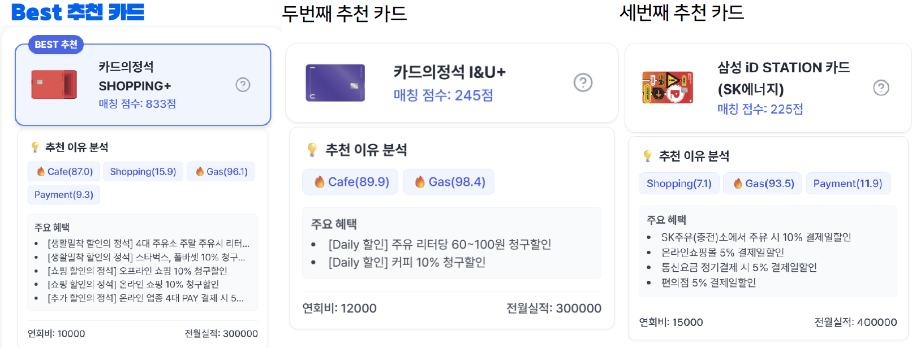
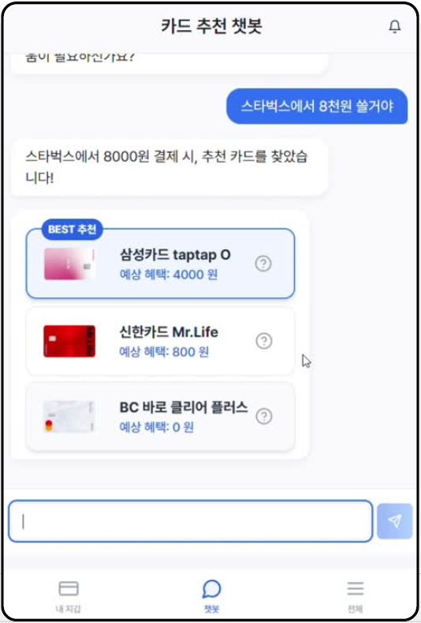
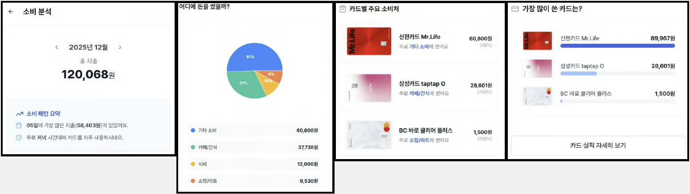
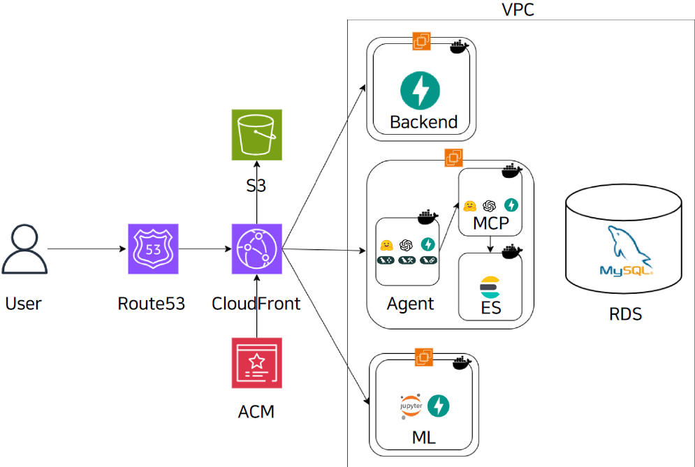
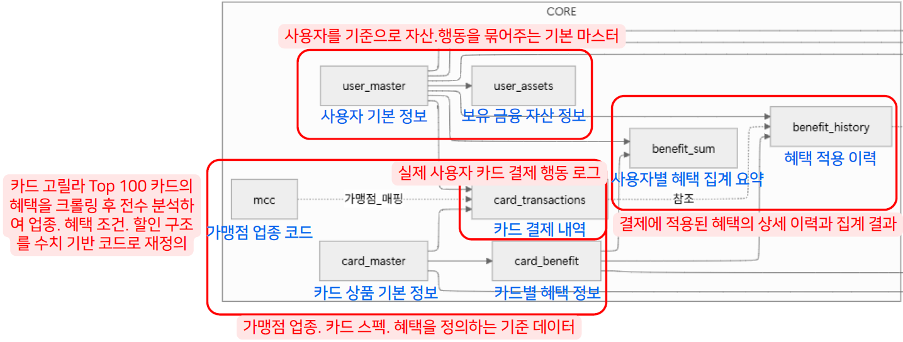
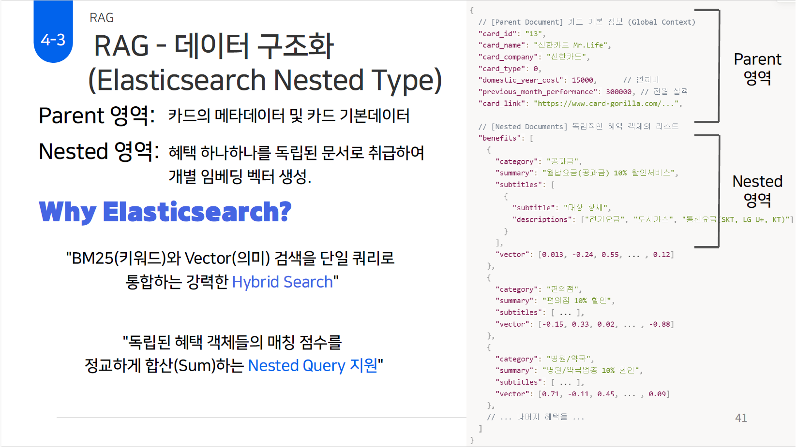
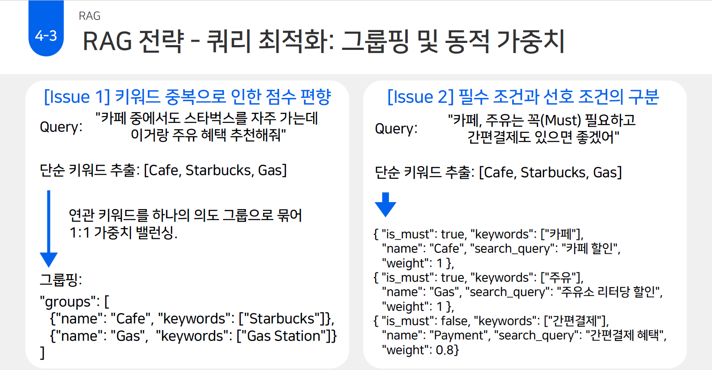
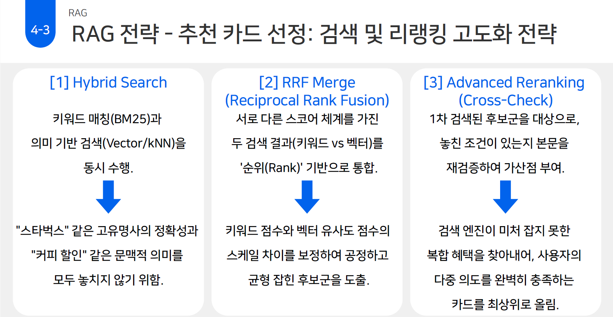

# CardBenePICK

**AI 기반 개인 맞춤형 카드 혜택 추천 및 자산 관리 플랫폼**

카드 혜택은 할인율만으로 비교하기 어렵습니다. 전월 실적, 가맹점 업종, 이용 횟수, 월 한도에 따라 같은 결제에서도 받을 수 있는 혜택이 달라집니다. CardBenePICK은 이러한 조건과 사용자 소비 정보를 함께 고려해, 결제 상황에 맞는 보유 카드와 소비 목적에 맞는 신규 카드를 추천하는 서비스입니다.

| 항목 | 내용 |
| --- | --- |
| 개발 기간 | 2025.10 ~ 2025.12 / 8주 |
| 프로젝트 | 우리FISA 5기 AI 엔지니어링 최종 프로젝트 |
| 참여 인원 | 5명 |
| 발표자료 | [발표자료 PDF](docs/CardBenePICK_Presentation.pdf) |
| 나의 담당 영역 | 카드 데이터 수집·전처리, DB 스키마 설계, RAG 검색·추천, 웹 서비스 및 AI Agent 연동 |

이 프로젝트에서 카드 혜택을 검색과 추천에 활용할 수 있도록 구조화하고, 여러 소비 조건을 한 번에 반영하는 RAG 검색 흐름을 구현했습니다. 자체 구성한 복합 질의 100개를 평가한 결과, **Hit Rate@3 75.0%, MRR 0.60**을 기록했습니다.

> 추천 예시: “카페, 쇼핑, 주유, 간편결제 혜택을 가진 카드를 추천받고 싶어요.”

## 나의 담당 역할

| 영역 | 수행 내용 |
| --- | --- |
| 데이터 수집·전처리 | 발급이 중단된 상품을 제외한 약 2,080개 카드 상품의 혜택 정보를 수집·전처리하고, 혜택 조건·업종·한도·가맹점 정보를 구조화했습니다. |
| DB 설계 | 카드 상품, 개별 혜택, MCC 업종 코드, 사용자 보유 카드, 결제 내역, 혜택 적용 이력의 관계를 정리하고 스키마와 ERD를 설계했습니다. |
| 검색 구현 | Elasticsearch Nested 구조를 적용하고, BM25 키워드 검색과 벡터 검색을 결합한 카드 검색 흐름을 구현했습니다. |
| RAG 시나리오·프롬프트 | 질의에서 소비 조건을 추출하고, 의도 그룹과 필수·선호 조건을 검색에 반영하는 전략을 설계했습니다. |
| 서비스 연동 | React와 FastAPI 간 요청·응답 구조를 설계하고, RAG 검색 결과와 AI Agent 응답을 화면에 연결했습니다. |
| 품질 점검 | LangSmith 로그로 응답과 검색 과정을 확인하고, 평가셋 구성 및 검색 성능 평가를 진행했습니다. |

## 주요 기능

| 기능 | 설명 |
| --- | --- |
| 보유 카드 추천 | 결제 금액과 가맹점, 보유 카드의 혜택 조건·전월 실적·사용 한도를 바탕으로 추천 카드와 예상 혜택을 제공합니다. |
| 신규 카드 추천 | 자연어로 입력한 여러 소비 조건을 분석해 관련 카드와 매칭된 혜택, 추천 근거를 보여줍니다. |
| 소비 패턴 분석 | 소비 내역을 업종과 기간별로 정리하고, 소비 유형 분류와 카드 추천에 활용합니다. |
| 카드 실적·자산 관리 | 카드별 사용 금액과 실적 달성 현황, 보유 자산, 소비 기록을 확인할 수 있습니다. |

사용자·자산·결제 데이터는 마이데이터 흐름을 가정한 더미 데이터로 구성했습니다.

보유 카드 추천과 소비 분석 화면

### 결제 상황별 보유 카드 추천

가맹점과 결제 금액을 입력하면 보유 카드별 예상 혜택을 비교할 수 있습니다.

### 소비 패턴 분석

소비 요약, 업종별 소비 분포, 카드별 사용 내역을 확인할 수 있습니다.

## 기술 스택 및 시스템 구성

| 구분 | 사용 기술 | 용도 |
| --- | --- | --- |
| Frontend | TypeScript, React, Vite, Axios | 서비스 화면과 API 연동 |
| Backend | Python, FastAPI, SQLModel | 웹 API와 DB 모델 |
| 데이터·검색 | MySQL, Elasticsearch, BM25, Vector Search | 사용자·카드 데이터 관리와 혜택 검색 |
| RAG | BAAI/bge-m3, Llama-3.1-8B-Instruct | 혜택 임베딩과 질의 분석 |
| AI Agent | LLM API, LangChain, LangGraph, MCP | 사용자 질의에 따른 검색·조회 도구 호출 |
| 로그·평가 | LangSmith, 자체 검색 평가 코드 | 실행 과정 추적과 검색 품질 점검 |
| 데이터 파이프라인 | Airflow | 카드 데이터 수집·적재와 알림 작업 |
| 인프라 | Docker, Docker Compose, AWS EC2·S3·RDS | 서비스 컨테이너 구성과 배포 |
| 협업 | Git, GitHub, Notion | 형상 관리와 작업 공유 |

웹 서비스, AI Agent, MCP 서버, Elasticsearch, 소비 유형 분류 모델을 나누어 구성했습니다. 위 기술 스택과 아키텍처는 팀 전체 서비스 기준이며, 개인 담당 범위는 데이터 구조 설계와 RAG 검색·추천, API 연동입니다.

## 구현 과정

### 1. 카드 혜택을 검색·계산에 사용할 수 있도록 구조화

카드 설명에는 할인 대상, 실적 구간, 할인율, 횟수 제한, 월 한도가 함께 들어 있습니다. 이 정보를 그대로 저장하면 특정 혜택을 검색하거나 결제 조건과 비교하기 어려웠습니다.

카드 기본 정보와 개별 혜택을 구분하고, 혜택 조건과 업종·가맹점 정보를 정리했습니다. MCC 코드는 가맹점 업종과 혜택 대상을 연결하는 기준으로 사용했습니다. 결제 내역과 혜택 적용 이력도 별도로 관리해 실적과 한도 정보를 조회할 수 있도록 설계했습니다.

| 데이터 | 설계 목적 |
| --- | --- |
| 카드 상품 기본 정보 | 카드명, 카드사, 연회비, 전월 실적 등 상품 공통 정보 관리 |
| 개별 혜택 정보 | 혜택 대상, 할인·적립 조건, 한도 등 혜택별 조건 관리 |
| MCC 업종 정보 | 가맹점 업종과 카드 혜택 대상 연결 |
| 사용자·보유 자산 | 사용자별 보유 카드와 자산 정보 관리 |
| 결제 내역·혜택 이력 | 카드 사용 내역과 적용된 혜택을 기록하고 집계 |

관련 코드: [DB 모델](cardbenepick-app/backend/app/db/models.py)

### 2. 카드 단위 문서 안에서 개별 혜택을 독립적으로 검색

“카페와 편의점 혜택이 있는 카드”를 찾을 때는 두 조건이 같은 카드의 서로 다른 혜택에 들어 있을 수 있습니다. 검색 단위를 카드 설명 전체로 두면 일부 혜택만 강하게 매칭되거나, 어떤 혜택이 추천 근거가 되었는지 확인하기 어려웠습니다.

Elasticsearch에서 카드 기본 정보를 Parent 영역에 두고, 개별 혜택을 `benefits` 배열의 Nested 객체로 구성했습니다. 각 혜택에 임베딩 벡터를 생성해 의미 검색을 수행하고, Nested Query의 `score_mode: sum`으로 매칭된 혜택의 점수를 카드 단위로 합산했습니다.

Elasticsearch 문서 구조

관련 코드: [Nested 매핑·데이터 적재](Agent/app/rag/ingest_v3_pipeline_top100.py)

### 3. 복합 질의를 의도별로 나누고 조건의 중요도 반영

“카페 중에서는 스타벅스를 자주 가고, 주유 혜택도 필요하다”는 질문에서 카페와 스타벅스를 별도 조건으로 합산하면 카페 관련 점수가 과하게 반영될 수 있습니다. 반면 서로 다른 업종을 하나로 묶으면 사용자의 여러 요구를 구분하기 어렵습니다.

질의에서 브랜드와 업종 키워드를 추출한 뒤, 관련 키워드는 하나의 의도 그룹으로 묶고 서로 다른 소비 목적은 분리했습니다. 각 그룹에는 검색 문장과 가중치를 부여했습니다. “꼭”, “필수”와 같은 표현은 `is_must`로 구분하고 추천 점수에 가중치를 주었습니다.

관련 코드: [질의 분석·의도 그룹화](Agent/app/rag/chatbot_pipeline.py)

### 4. 키워드와 의미 검색 결과를 결합하고 추천 순위 조정

브랜드명은 정확한 키워드 매칭이 필요하고, “커피 할인”처럼 표현이 달라지는 조건은 의미 검색이 필요했습니다. 각 의도 그룹에 대해 BM25와 벡터 검색을 수행한 뒤 RRF로 결과를 병합했습니다.

후보 카드가 정해진 후에는 혜택 정보를 다시 확인했습니다. 검색 단계에서 매칭되지 않은 의도 그룹이 있는지 검사하고, 여러 소비 조건에 매칭되는 카드에 추가 점수를 반영했습니다.

| 단계 | 처리 내용 |
| --- | --- |
| Hybrid Search | BM25와 벡터 검색으로 각 의도에 맞는 후보 조회 |
| RRF 병합 | 검색 결과의 순위를 기준으로 후보 통합 |
| 조건 재확인 | 카드의 혜택 요약과 업종에서 추가로 매칭되는 조건 확인 |
| 순위 조정 | 의도별 가중치, 필수 조건, 매칭된 의도 수를 점수에 반영 |
| 결과 반환 | 상위 3개 카드와 매칭된 혜택, 추천 근거, 연회비·전월 실적 정보 반환 |

추천 응답에는 `card_id`, `card_name`, `benefit_list`, `match_reason`, `score` 등을 포함했습니다. React 화면에서는 이 정보를 사용해 카드별 혜택과 추천 근거를 비교할 수 있도록 연동했습니다.

관련 코드: [검색·RRF·순위 조정](Agent/app/rag/chatbot_pipeline.py)

### 5. AI Agent와 웹 서비스 연동

보유 카드 추천에는 카드 약관 외에도 가맹점 업종, 사용자 보유 카드, 실적 충족 여부, 당월 혜택 사용량과 잔여 한도 정보가 필요했습니다. 이 정보를 DB 조회 도구로 제공하고, Agent가 조회한 조건을 바탕으로 혜택 비교와 추천 응답을 구성하도록 연결했습니다.

이 과정에서 조회에 필요한 입력과 화면에 반환할 응답 필드를 정리하고, React·FastAPI·AI Agent 간 데이터 흐름을 확인했습니다. 카드 추천 결과와 혜택 정보가 화면에 전달되는 과정도 점검했습니다.

관련 코드: [Agent 구성](Agent/app/agent/agent_graph.py) · [MCP 서버](Agent/mcp) · [웹 API](cardbenepick-app/backend/app/api)

## 검색 평가 및 품질 점검

### 평가셋 구성 개선

초기에는 사용자가 입력할 법한 질문을 만들고, 질문별 정답 카드를 3개로 제한했습니다. 하지만 같은 혜택 조건을 만족하는 카드가 더 많아, 유효한 추천이 정답 목록에 없다는 이유로 오답 처리될 수 있었습니다.

평가 대상 카드의 혜택에서 4~5개 키워드를 추출하고, 이를 조합해 복합 질의 100개를 구성했습니다. 각 질의를 만드는 데 사용한 카드를 정답으로 지정해 질의와 정답의 연결을 분명히 했습니다.

### 평가 결과

| 항목 | 결과 |
| --- | --- |
| 평가 대상 | Top 100 카드 기반의 복합 질의 100개 |
| Hit Rate@3 | **75.0% (75/100)** |
| MRR | **0.60** |

Hit Rate@3는 상위 3개 추천에 정답 카드가 포함된 비율입니다. MRR는 정답 카드의 역순위를 평균한 값이며, 상위 3개에 정답이 없으면 0으로 계산했습니다. 위 수치는 카드 혜택 정보를 바탕으로 구성한 내부 검색 평가셋의 결과입니다.

관련 자료: [평가셋](Agent/app/rag/data/evaluation_dataset_complex_top100_generated.json) · [평가 코드](Agent/app/rag/evaluate_performance_upgrade1.py)

### 실행 로그 확인

LangSmith 로그와 단계별 출력을 함께 확인하며 추출 키워드, 의도 그룹, 검색 후보, 최종 추천 결과를 점검했습니다. 결과가 기대와 다를 때 질의 해석과 검색 결과를 각각 살펴보고, 프롬프트와 데이터 구조를 수정할 지점을 찾았습니다.

## 회고

복합 조건 검색을 구현하면서 카드 데이터를 어떤 단위로 나누고 연결하는지가 추천 결과에 직접 영향을 준다는 점을 확인했습니다. 카드 설명을 저장하는 것에서 끝내지 않고, 혜택별 검색 단위와 추천 근거를 함께 설계해야 했습니다.

평가 과정에서도 같은 기준이 필요했습니다. 정답 목록을 충분히 정의하지 않으면 올바른 추천을 놓칠 수 있어, 검색 로직과 함께 평가셋의 구성 방식을 점검했습니다. 이 경험을 통해 모델이나 프롬프트를 바꾸기 전에 입력 데이터와 평가 기준을 먼저 확인하는 습관을 갖게 되었습니다.

또한 데이터 수집부터 검색, API 응답, 화면 표시까지 이어지는 과정을 맡으며 각 단계의 입력·출력 형식을 맞추고 로그로 확인하는 작업의 중요성을 배웠습니다.

## 코드 구성

| 경로 | 내용 |
| --- | --- |
| [Agent/app/rag/](Agent/app/rag) | 카드 데이터 적재, 질의 분석, 검색·추천, 평가 코드 |
| [Agent/app/agent/](Agent/app/agent) | LangGraph 기반 Agent 구성 |
| [Agent/mcp/](Agent/mcp) | 카드·사용자 데이터 조회와 추천 도구 |
| [cardbenepick-app/backend/](cardbenepick-app/backend) | FastAPI 웹 서버와 DB 모델 |
| [cardbenepick-app/frontend/](cardbenepick-app/frontend) | React 서비스 화면과 API 연동 |
| [model-server/](model-server) | 소비 유형 분류 모델과 예측 API |
| [airflow/](airflow) | 카드 데이터 수집·적재 및 알림 DAG |
| [docs/image/](docs/image) | README에 사용한 서비스 화면과 설계 이미지 |

## 팀

우리FISA 5기 AI 엔지니어링 5팀 **베테크**

이계무 · 김유라 · 남상원 · 오윤진 · 최수빈